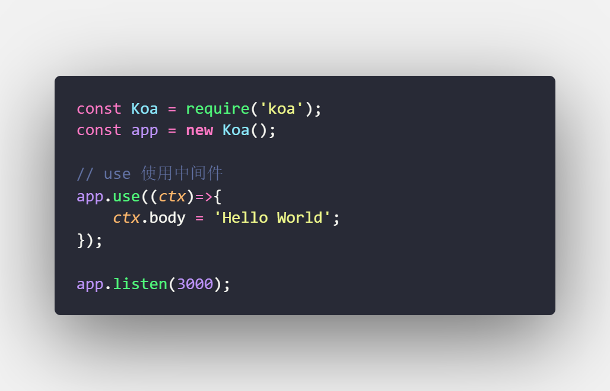
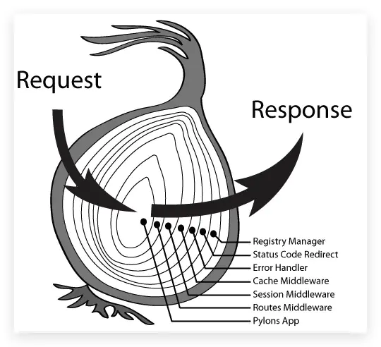
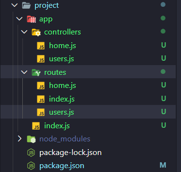
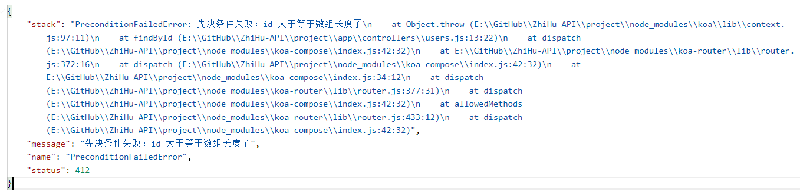
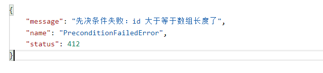

## Koa 简介（抠啊）

- 基于 Node.js 的下一代 Web 框架
  - 基于 Node.js：Node.js 模块
  - 下一代：蚕食第一代 Web 框架 Express 的市场
  - Web 框架：不是命令行工具、不是算法
- 官网简介：Koa 是一个新的 web 框架
  - **由 Express 幕后的原班人马打造**
  -  **Web 应用和 API 开发领域**
  - **更小、更富有表现力、更健壮**
  - **利用 async 函数 ，丢弃回调函数****，
  - **增强错误处理（try catch）**。
  - **Koa 没有捆绑任何中间件**
  - **快速而愉快的编写服务端应用程序**

## 操作步骤

- 初始化项目
- 安装 Koa
- 编写 Hello World
- 学习自动重启 —— `nodemon 模块`



补：开发环境下，自动重启模块安装时加 `--dev`


## async 使用

正常使用异步函数，会有嵌套关系。

```js
fetch( ' //api.github.com/users ' ).then(res => res.json()).then(json=>{
    console.log(json);
    fetch( '//api.github.com/users/lewis617' ).then(res => res.json()).then(json2 =>{
        console.log(json2);
    })
})
```

使用 async 语法

```js
(async () =>{
	const res = await fetch( '//api.github.com/users');
	const json = await res.json();
	console.log(json);
	const res2 = await fetch( ' //api.github.com/users/lewis617');
	const json2 = await res2.json();
    console.log(json2);
})()

```

## Koa 中间件与洋葱模型

Koa 执行下一个中间件需要调用 `next()`

```js
app.use(async (ctx, next)=>{
    // 调用下一个中间件
    await next();
    console.log(1);
    ctx.body = 'Hello Zhihu API';
});
app.use(async (ctx)=>{
    console.log(2);
})
```

### 洋葱模型

洋葱模型是一种中间件流程控制方式。



```js
const Koa = require('koa');
const app = new Koa();

app.use(async (ctx, next) => {
  console.log('中间件 1 进入');
  await next();
  console.log('中间件 1 退出');
});

app.use(async (ctx, next) => {
  console.log('中间件 2 进入');
  await next();
  console.log('中间件 2 退出');
});

app.use(async (ctx, next) => {
  console.log('中间件 3');
});

app.listen(3000);
```

结果：

```js
中间件 1 进入
中间件 2 进入
中间件 3 
中间件 2 退出
中间件 1 退出
```

## 路由

### 路由是什么？

- 决定了不同 URL 是如何被不同地执行的
- 在 Koa 中，是一个中间件

### 为什么要用路由？

- 如果没有路由？
  - 所有请求都做了相同的事
  - 所有的请求都会返回相同的结果

### 路由存在的意义

- 处理不同的 URL
- 处理不同的 HTTP 方法
- 解析 URL 上的参数

## 编写 Koa 路由中间件

### 操作步骤

- 处理不同的 URL
- 处理不同的 HTTP 方法
- 解析 URL 上的参数

```js
const Koa = require('koa');
const app = new Koa();

// use 使用中间件
app.use(async (ctx)=>{
    if(ctx.url === '/'){
        ctx.body = '这是主页';
    }else if(ctx.url === '/users'){				// 处理不同的 URL
        if(ctx.method === 'GET'){				// 处理不同的 HTTP 方法
            ctx.body = '这是用户列表页';
        }else if(ctx.method === 'POST'){
            ctx.body = '创建用户';
        }else{
            // 405：不允许这个方法
            ctx.status = 405;
        }
    }else if(ctx.url.match(/\/users\/\w+/)){	// 解析 URL 上的参数
        // 匹配正则：\w 匹配字母 + 一个或多个
        // 匹配符合小括号内的内容: userId
        // [
        //     "/users/111",
        //     "111"    
        // ]
        const userId = ctx.url.match(/\/users\/(\w+)/)[1];
        ctx.body = `这是用户 ${userId}`;
    }else {
        // 404：服务器上没有找到请求的资源
        ctx.status = 404;
    }
});

app.listen(3000);
```

## 使用 koa-router 实现路由

- 更优雅的实现路由基本功能
- 演示一些高级路由功能，如前缀、多中间件

```js
const Koa = require('koa');
const Router = require('koa-router');
const app = new Koa();
const router = new Router();
// 前缀替代
const usersRouter = new Router({ prefix: '/users' });

// 多中间件，使用场景：用户校验、数据安全（分层系统里面的安全层);
// 鉴权
const auth = async(ctx, next) => {
    if(ctx.url !== 'users'){
        ctx.throw(401);
    }
};

// 处理不同的 URL
router.get('/', (ctx)=>{
    ctx.body = '这是主页';
});
// 正常写法=============================
// router.get('/users', (ctx)=>{
//     ctx.body = '这是用户列表';
// });

// // 处理不同的 HTTP 方法
// router.post('/users', (ctx)=>{
//     ctx.body = '创建用户';
// });

// // 解析 URL 参数
// router.get('/users/:id', (ctx)=>{
//     ctx.body = `这是用户 ${ctx.params.id}`;
// });

// 前缀写法============================= 
usersRouter.get('/', (ctx)=>{
    ctx.body = '这是用户列表';
});
usersRouter.post('/', (ctx)=>{
    ctx.body = '创建用户';
});
// 多中间件，仿鉴权
usersRouter.get('/:id',auth, (ctx)=>{
    ctx.body = `这是用户 ${ctx.params.id}`;
});

// router.routes() 来加载路由中间件
app.use(router.routes());
// 前缀路由中间件
app.use(usersRouter.routes());


app.listen(3000);
```

## HTTP options方法的作用是什么？

### 为何要了解 options 方法的作用? 

- 这是一道面试题
- 帮助理解 koa-router 的 allowedMethods 的作用

### options 方法的作用

- 检测服务器所支持的请求方法
- CORS 中的预检请求（检测是否允许跨域）

### allowedMethods 的作用

- 响应 options 方法，告诉它所支持的请求方法
  - `app.use(usersRouter.allowedMethods());`
- 相应的返回 405（不允许）和 501（没实现）
  - **405 不允许**：服务器支持该方法，但是还未对该方法进行响应处理。
  - **501 没实现**：服务器本身不支持该方法。


##   RESTful API 最佳实践——增删改查应该返回什么响应？

### 操作步骤

- 实现增删改查
- 返回正确的响应

```js
// 1、获取用户列表
usersRouter.get('/', (ctx) => {
    ctx.body = [
        { name: '李雷' },
        { name: '韩梅梅' }
    ];
});
// 2、新建用户
usersRouter.post('/', (ctx) => {
    ctx.body = { name: '李雷' };
});
// 3、获取用户
usersRouter.get('/:id', (ctx) => {
    ctx.body = { name: '李雷' };
});
// 4、修改用户
usersRouter.put('/:id', (ctx) => {
    ctx.body = { name: '李雷2' };
});
// 5、删除用户
usersRouter.delete('/:id', (ctx) => {
    // 删除成功，但是不返回内容
    ctx.status = 204;
});
```


## 控制器简介

### 什么是控制器？

- 拿到路由分配的任务，并执行
- 在 Koa 中，是一个中间件

### 为什么要用控制器？

- 获取 HTTP 请求参数
- 处理业务逻辑
- 发送 HTTP 响应

#### 1. 获取 HTTP 请求参数

- Query String，如 `?q=keyword`
- Router Params，如 `/users/:id`
- Body，如 `{name: "李雷"}`
- Header，如 `Accept（媒体格式）、Cookie`

#### 2. 发送 HTTP 响应

- 发送 Status，如 `200/400` 等
- 发送 Body，如 `{ name: "李雷" }`
- 发送 Header，如 `Allow、Content-Type`

### 编写控制器最佳实践

- 每个资源的控制器放在不同的文件里
- 尽量使用类 + 类方法的形式编写控制器
- 严谨的错误处理

### 获取 HTTP 请求参数

#### 操作步骤

- 学习断点调试
- 获取 query 
- 获取 router params
- 获取 body
  - 需要安装 Koa 中间件 —— `koa-bodyparser`
- 获取 header 

### 发送 HTTP 响应

- 发送 status 
  - `ctx.status = 204;`
- 发送 body
  - `*ctx*.body = { name: '李雷' };`
- 发送 header
  -  `ctx.set('Allow', 'GET, POST');`
- 实现用户的增删改查

```js
// 内存数据库
const db = [{ name: "李雷" }];

usersRouter.get('/', (ctx) => {
    // 设置响应头
    // ctx.set('Allow', 'GET, POST');
    ctx.body = db;
});
// 2、新建用户
usersRouter.post('/', (ctx) => {
    // 从请求体中获取新增加的用户
    db.push(ctx.request.body);
    ctx.body = ctx.request.body;
});
// 3、获取用户
usersRouter.get('/:id', (ctx) => {
    // 字符串转数字
    ctx.body = db[ctx.params.id * 1];
});
// 4、修改用户
usersRouter.put('/:id', (ctx) => {
    db[ctx.params.id * 1] = ctx.request.body;
    ctx.body = ctx.request.body;
});
// 5、删除用户
usersRouter.delete('/:id', (ctx) => {
    // 删除数组中的内容
    db.splice(ctx.params.id * 1,1);
    // 删除成功，但是不返回内容
    ctx.status = 204;
});
```

## 更合理的目录结构

### 操作步骤

- 将路由单独放在一个目录里
- 将控制器单独放在一个目录
- 使用类 + 类方法的方式组织控制器



路由批量导入并注册：

`./routes/index.js`

```js
// 批量读取目录下的文件，进行注册
const fs = require('fs');

module.exports = (app) => {
    // 同步读取目录
    fs.readdirSync(__dirname).forEach(file => {
        if (file === 'index.js') { return; }
        // 导入路由文件
        const route = require(`./${file}`);
        // 注册路由，并且支持响应 options 方法
        app.use(route.routes()).use(route.allowedMethods());
    })
}
```

`./index.js`

```js
const Koa = require('koa');
const bodyparser = require('koa-bodyparser');
const app = new Koa();
const routing = require('./routes');

// 注册请求体解析中间件
app.use(bodyparser());
// 批量读取注册路由
routing(app);

app.listen(3000, () => console.log('程序启动在 3000 端口'));
```

控制器与路由分离：(采用类写法)

`./controllers/home.js`

```JS
// ES6 类写法
class HomeCtl {
    index(ctx){
        ctx.body = '这是主页';
    }
}

// 实例化类并导出
module.exports = new HomeCtl();
```

`./routes/home.js`

```js
// 主页路由
const Router = require('koa-router');
const router = new Router();
const { index } = require('../controllers/home');

router.get('/', index);

module.exports = router;
```


## 错误处理（异常处理）

### 什么是错误处理？

- 编程语言或计算机硬件里的一种机制
- 处理软件或信息系统中出现的异常状况

### 异常状况

- 运行时错误，都返回 500
- 逻辑错误，如找不到（404）、先决条件失败（412）、无法处理的实体（参数格式不对，422）等
  - `404 Not Found`
  - `412 Precondition Failed`
  - `500 Internal Server Error`

### 为什么要用错误处理？

- 防止程序挂掉
- 告知用户错误信息
- 便于开发者调试

## Koa 自带的错误处理

### 操作步骤

- 制造 404、412、500 三种错误

  - 412 可以手动抛出

    ```js
    ctx.throw(412, '先决条件失败：id 大于等于数组长度了');
    ```

- 了解 Koa 自带的错误处理做了什么

## 自己编写错误处理中间件

### 操作步骤

- 自己编写错误处理中间件

- 制造 404、412、500 三种错误来测试

  ```js
  
  // 编写错误处理中间件
  app.use(async (ctx,next) => {
      try{
          await next();
      }catch(err){
          ctx.status = err.status || err.statusCode || 500;
          ctx.body = {
              message: err.message
          };
      }
  });
  ```

  

## 使用 koa-json-error 进行错误处理

### 操作步骤

- 安装 koa-json-error

- 使用 koa-json-error 的默认配置处理错误

- 修改配置使其在生成环境下禁用错误堆栈的返回

  - 开发环境下：

    

  - 生产环境下：

    

  - 通过修改配置：`postFormat`——定制返回格式

    ```js
    app.use(error({
        // 在生产环境禁用错误堆栈的返回
        // 获取环境变量 process.env.NODE_ENV
        // 第二个参数为返回的对象
        postFormat: (e, { stack, ...rest }) => process.env.NODE_ENV  === 'production' ? rest : { stack, ...rest }
    }));
    ```

  - cross-env：跨平台设置环境变量

  - `./package.json`

    ```json
    "scripts": {
        // linux 下可以直接配置环境变量
        //"start": "NODE_ENV=production node app"
        "start": "cross-env NODE_ENV=production node app",
        // 开发环境下
        "dev": "nodemon app"
     },
    ```

    